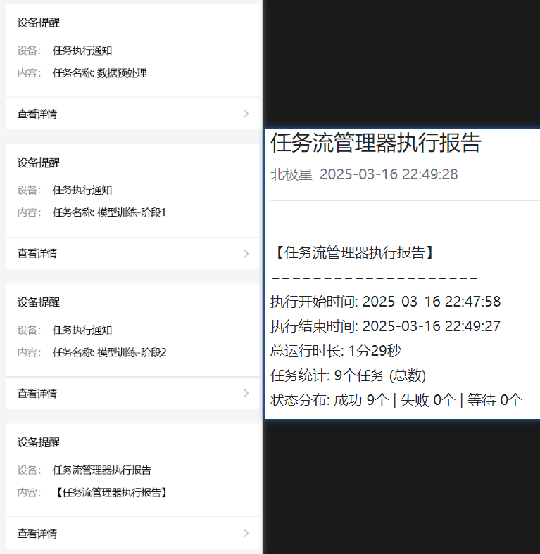

# MultiTaskFlow 多任务流管理工具

MultiTaskFlow 是一个轻量级的多任务流管理工具，用于按顺序执行和监控一系列任务。它可以帮助您管理数据处理、模型训练、评估等一系列需要顺序执行的任务，并提供实时状态更新和执行结果跟踪。

## 功能特点

- 基于YAML配置文件定义任务流
- 支持Python脚本和Shell命令的执行
- 提供任务状态实时监控
- 自动执行失败任务的重试逻辑
- 支持任务之间的依赖关系
- 完整的日志记录和任务执行历史

## 效果展示

在使用本工具之前，您可以运行我们提供的演示脚本，查看任务管理和消息接收的实际效果。演示脚本模拟了一个完整的深度学习工作流，包括数据预处理、模型训练、模型评估和数据归档等步骤。

### 运行演示脚本

```bash
# 克隆仓库后，进入项目目录
cd MultiTaskFlow

# 直接运行示例脚本
python examples/example.py
```

### 演示内容

演示脚本将依次执行以下任务：

1. **数据预处理** - 模拟数据集加载、清洗和处理过程
2. **模型训练-阶段1** - 模拟第一阶段模型训练过程
3. **模型评估-阶段1** - 模拟对第一阶段训练模型的评估
4. **模型训练-阶段2** - 模拟基于第一阶段模型继续训练
5. **模型评估-阶段2** - 模拟对第二阶段训练模型的评估
6. **数据归档** - 模拟模型和结果数据的归档过程

每个任务都会显示详细的执行进度和模拟输出，让您直观了解MultiTaskFlow的任务管理能力。所有演示任务都是模拟执行，不会创建实际文件或占用大量资源。

### 期望效果

运行示例后，您将看到：

- 任务管理器启动和初始化过程
- 任务状态的实时更新（等待中→执行中→完成/失败）
- 每个任务的详细输出和进度信息
- 任务完成后的状态汇总

通过观察演示效果，您可以了解MultiTaskFlow如何帮助管理复杂的多步骤工作流程，以及它如何提供清晰的任务执行状态和结果反馈。

### 运行效果截图


截图应当展示：
- 任务管理器启动界面
- 多个任务按顺序执行的过程
- 任务状态变化和详细输出
- 任务完成后的摘要信息



*实际运行时在控制台中会看到输出，显示任务状态和进度信息*

## 安装方法

### 要求

- Python 3.7+
- PyYAML
- 其他依赖库（如有）

### 从源码安装

```bash
# 克隆仓库
git clone https://github.com/yourusername/MultiTaskFlow.git
cd MultiTaskFlow

# 安装依赖
pip install -r requirements.txt

# 直接使用或安装到本地环境
pip install -e .
```

## 使用方法

### 创建任务配置文件

创建一个YAML格式的任务配置文件，定义您要执行的任务序列：

```yaml
# tasks.yaml 示例
- name: "任务1-数据准备"
  command: "python scripts/prepare_data.py --input data/raw --output data/processed"
  status: "pending"

- name: "任务2-模型训练"
  command: "python scripts/train_model.py --data data/processed --epochs 10"
  status: "pending"

- name: "任务3-结果评估"
  command: "python scripts/evaluate.py --model-path models/latest.pt"
  status: "pending"
```

### 使用Python API

在您的Python代码中使用MultiTaskFlow：

```python
from multitaskflow import TaskFlow

# 创建任务流管理器
task_manager = TaskFlow("path/to/your/tasks.yaml")

# 启动任务执行
task_manager.run()

# 您也可以动态添加任务
task_manager.add_task_by_config(
    name="额外任务", 
    command="echo '这是一个动态添加的任务'"
)
```

## 自定义与扩展

MultiTaskFlow设计为可扩展的，您可以：

- 自定义任务状态处理逻辑
- 添加新的任务类型
- 扩展监控和报告功能

请参考文档了解更多自定义选项。

## 贡献指南

欢迎贡献代码、报告问题或提出新功能建议！

## 许可证

[在此添加许可证信息] 